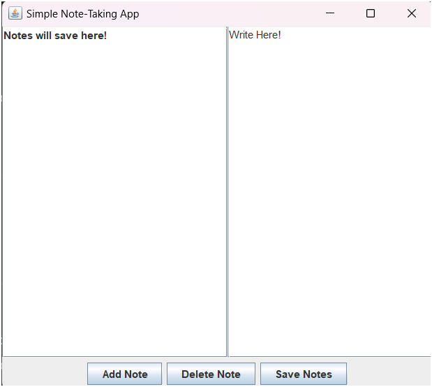

# Day 98: Simple Note-Taking App (GUI)

## 📝 Description

On Day 98 of my 100 Days of Code challenge, I created a simple note-taking application using Java Swing.

### **Objective:**
- Implement a basic note-taking app that allows the user to:
  - Add new notes.
  - View existing notes in a list.
  - Delete selected notes.
  - Save and load notes from a text file.

## 🚀 Code Overview
This Java program:
- Uses a `JTextArea` for adding and viewing notes.
- Displays a list of notes in a `JList` on the left side.
- Allows the user to save notes to a `.txt` file and load them when the app starts.
- Implements basic functionality like adding, deleting, and saving notes.

## 📂 File Structure
- `Day 98/`
  - `NoteApp.java`: Java program for the simple note-taking application.
  - `README.md`: This description file.

## 📋 How to Run
1. **Compile the program:**
   ```bash
   javac NoteApp.java
   ```
2. **Run the program:**
   ```bash
   java NoteApp
   ```

## 🔍 Example Output

A window opens with a `JTextArea` for adding notes, a `JList` to view all saved notes, and buttons to add, delete, and save notes.



---

**Day 98 complete!** On to Day 99!
