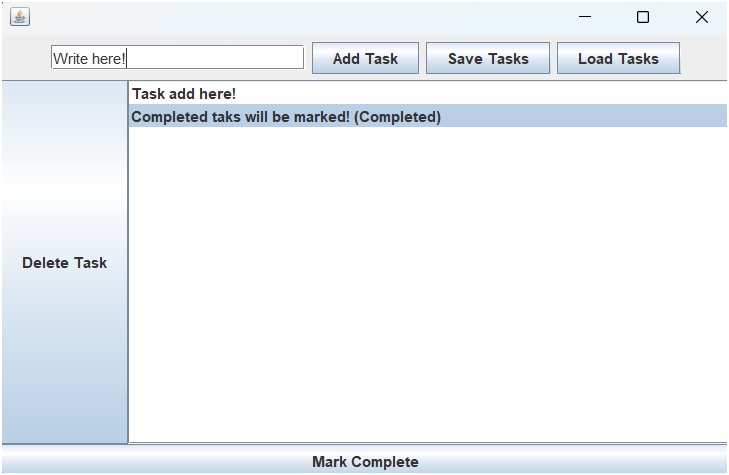

# Day 99: Task Manager App (GUI)

## 📝 Description

On Day 99 of my 100 Days of Code challenge, I created a simple task manager application using Java Swing.

### **Objective:**
- Implement a task manager app where users can:
  - Add tasks with a title and description.
  - Mark tasks as complete.
  - Delete tasks.
  - Save tasks to a file and load them when the app starts.

## 🚀 Code Overview
This Java program:
- Uses a `JTextArea` to view task descriptions.
- Provides a list of tasks using `JList`.
- Allows users to add, delete, and mark tasks as complete.
- Saves and loads tasks from a `.txt` file.

## 📂 File Structure
- `Day 99/`
  - `TaskManagerApp.java`: Java program for the task manager application.
  - `README.md`: This description file.

## 📋 How to Run
1. **Compile the program:**
   ```bash
   javac TaskManagerApp.java
   ```
2. **Run the program:**
   ```bash
   java TaskManagerApp
   ```

## 🔍 Example Output

A task manager window opens with buttons to add new tasks, mark tasks as complete, delete tasks, and save/load tasks.



---

**Day 99 complete!** On to Day 100!
